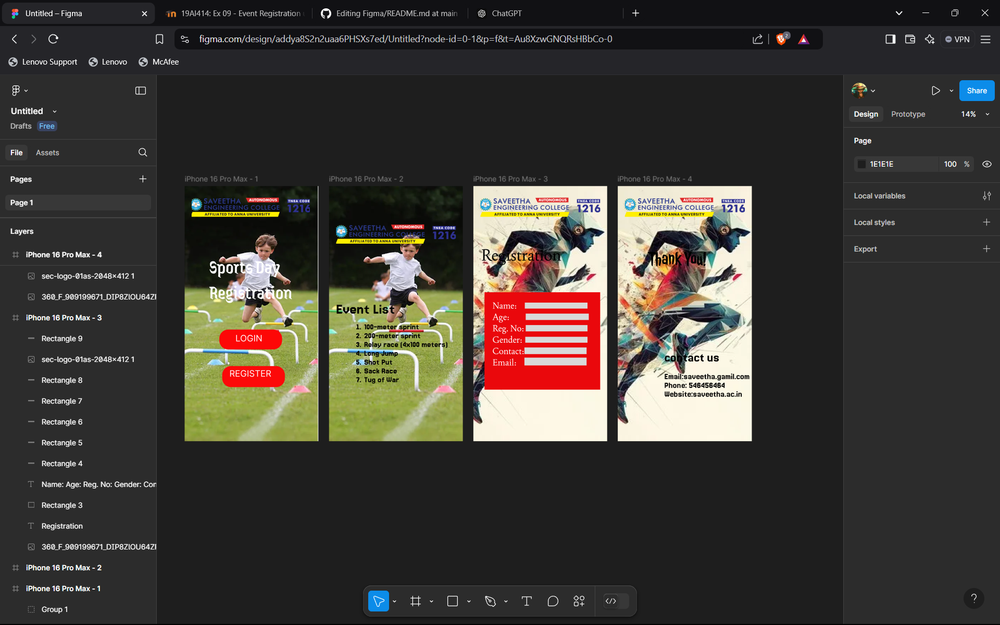

# Ex09 Event Registration Web Application
## Date:23/05/2025

## AIM:
To design, develop and deploy a web application for event registration.

## DESIGN STEPS:

### Step 1:
Create a new frame.

### Step 2:
Select any one preset size of your choice.

### Step 3:
Select the shapes you need.

### Step 4:
Import images as needed.

### Step 5:
Create pages based on your need and link them.

### Step 6:

Validate the HTML and CSS code.

### Step 6:

Publish the website in the given URL.

## DESIGN TOOL:
Figma

## CODE:
Home Page
```
<div class="container--0-">
  <div class="container-0-1-0">
    <svg
      width="716"
      height="225"
      viewBox="0 0 716 225"
      fill="none"
      xmlns="http://www.w3.org/2000/svg"
    >
      <path
        d="M0.610413 100C0.610413 44.7715 45.3819 0 100.61 0H615.485C670.714 0 715.485 44.7715 715.485 100V125C715.485 180.228 670.714 225 615.485 225H100.61C45.3819 225 0.610413 180.228 0.610413 125V100Z"
        fill="#FD0707"
      ></path>
    </svg>
    <div class="text-1-2-3">Sports Day<br />Registration</div>
    <svg
      width="715"
      height="239"
      viewBox="0 0 715 239"
      fill="none"
      xmlns="http://www.w3.org/2000/svg"
    >
      <rect
        x="0.330078"
        width="713.883"
        height="239"
        rx="100"
        fill="#FC0909"
      ></rect>
    </svg>
    <div class="text-1-2-5">REGISTER</div>
    <div class="text-1-2-6">LOGIN</div>
  </div>
</div>
```
event page
```
<div class="container--0-">
  
  <div class="text-0-1-1">
    100-meter sprint<br />200-meter sprint<br />Relay race (4x100 meters)<br />Long
    Jump<br />Shot Put<br />Sack Race<br />Tug of War
  </div>
  <div class="text-0-1-2">Event List</div>
  
</div>
```
Registration Page
```
<div class="container--0-">
  
  <div class="text-0-1-1">Registration</div>
  <svg
    width="1313"
    height="1106"
    viewBox="0 0 1313 1106"
    fill="none"
    xmlns="http://www.w3.org/2000/svg"
  >
    <rect width="1313" height="1106" fill="#EA080C"></rect>
  </svg>
  <div class="text-0-1-3">
    Name:<br />Age:<br />Reg. No:<br />Gender:<br />Contact:<br />Email:<br />
  </div>
  <svg
    width="711"
    height="68"
    viewBox="0 0 711 68"
    fill="none"
    xmlns="http://www.w3.org/2000/svg"
  >
    <rect width="711" height="68" fill="#D9D9D9"></rect></svg
  ><svg
    width="716"
    height="72"
    viewBox="0 0 716 72"
    fill="none"
    xmlns="http://www.w3.org/2000/svg"
  >
    <rect width="716" height="72" fill="#D9D9D9"></rect></svg
  ><svg
    width="701"
    height="71"
    viewBox="0 0 701 71"
    fill="none"
    xmlns="http://www.w3.org/2000/svg"
  >
    <rect width="701" height="71" fill="#D9D9D9"></rect></svg
  ><svg
    width="706"
    height="67"
    viewBox="0 0 706 67"
    fill="none"
    xmlns="http://www.w3.org/2000/svg"
  >
    <rect width="706" height="67" fill="#D9D9D9"></rect></svg
  ><svg
    width="706"
    height="75"
    viewBox="0 0 706 75"
    fill="none"
    xmlns="http://www.w3.org/2000/svg"
  >
    <rect width="706" height="75" fill="#D9D9D9"></rect></svg
  ><svg
    width="706"
    height="89"
    viewBox="0 0 706 89"
    fill="none"
    xmlns="http://www.w3.org/2000/svg"
  >
    <rect width="706" height="89" fill="#D9D9D9"></rect>
  </svg>
</div>
```
Thankyou Page
```
<div class="container--0-">
  
  <div class="text-0-1-2">Thank You!</div>
  <div class="text-0-1-3">
    contact us<br /><br />Email:saveetha.gamil.com<br />Phone: 546456464<br />Website:saveetha.ac.in
  </div>
</div>
```
## OUTPUT:



## RESULT:
The program to design, develop and deploy a web application for event registration is completed successfully.
